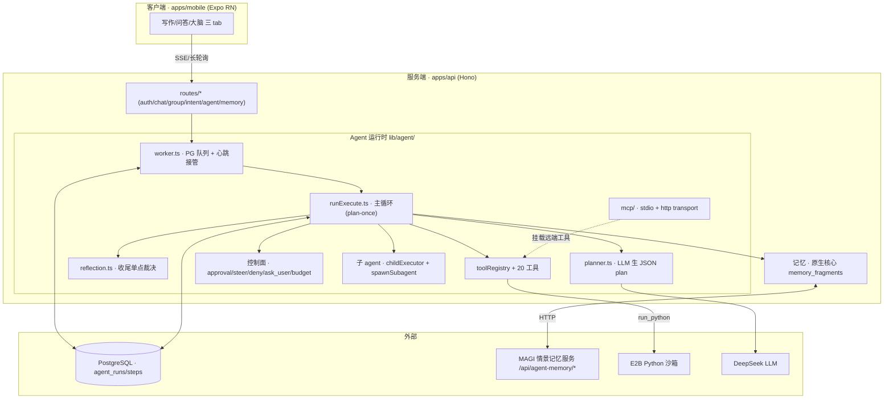
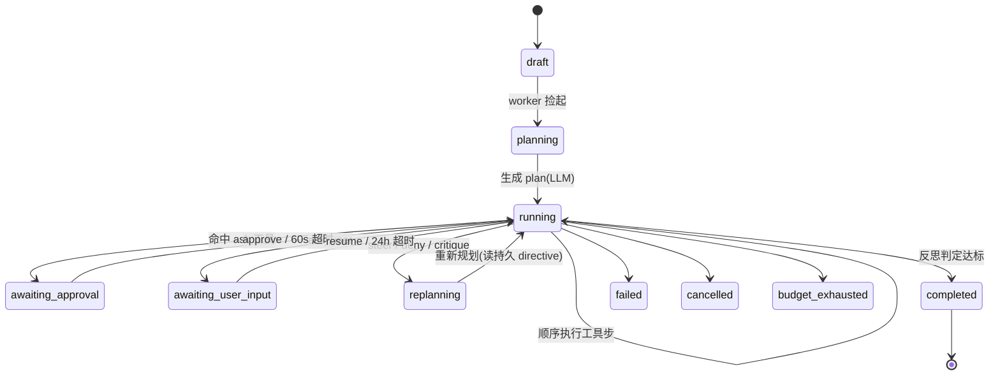
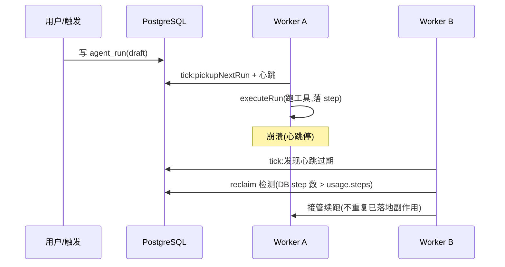
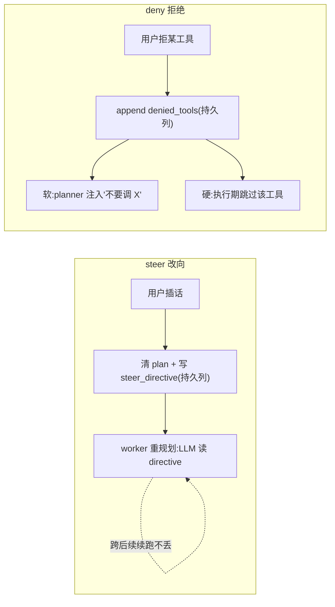
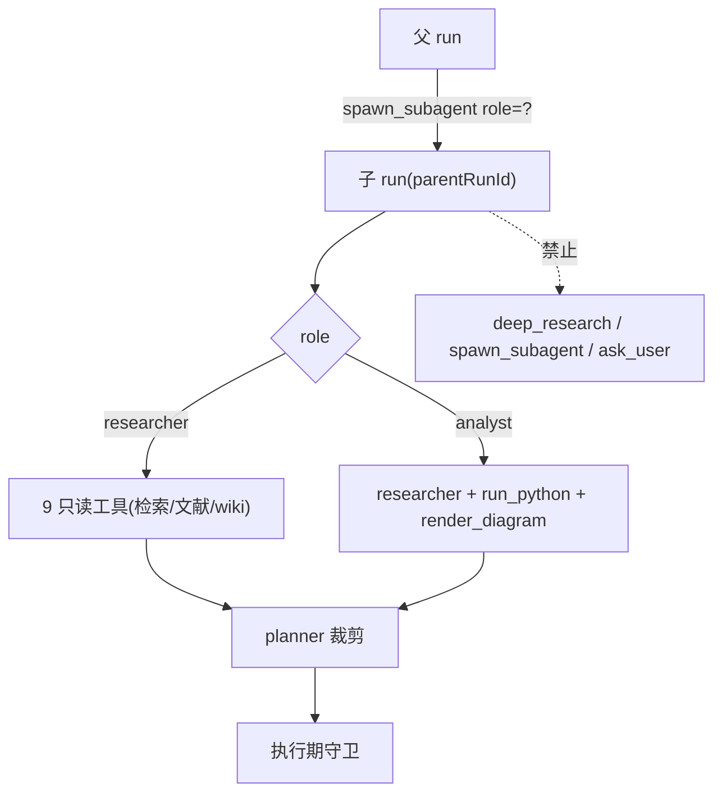
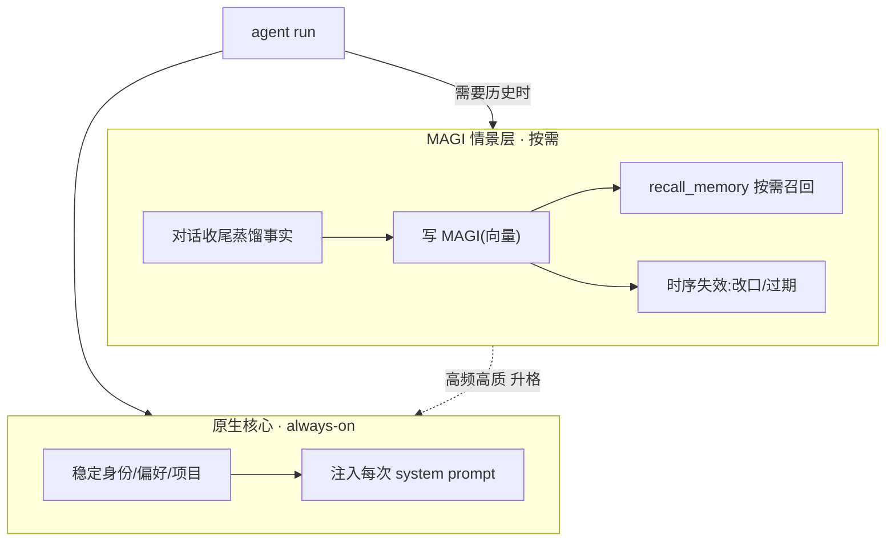
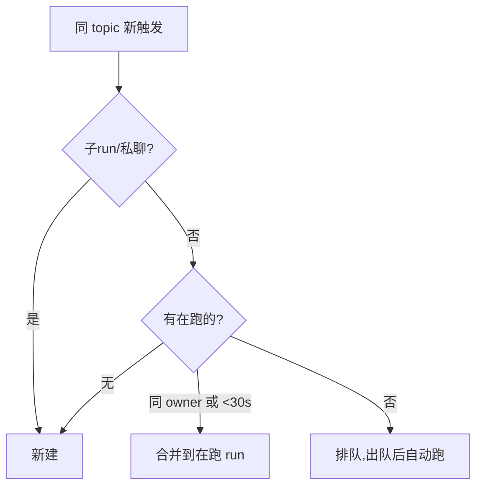
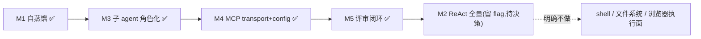

> 本报告剖析 `agent-Carl-Gustav-Jung` 的对话 Agent:**重点不在"有哪些功能",而在"每一处为什么这样设计、买到了什么好处、付出了什么代价"**。立场为「系统论述 + 诚实评估」——既讲清设计意图与独特性,也不讳言短板。所有技术细节均经源码逐行核实(正文附 `文件:行` 锚点),与同类 Agent 对标处给出 0–5 定性评分(非基准跑分,已注明)。面向自评、协作者与对外说明三类读者。
>
> **v2 修订说明(2026-06-10 晚)**:当日完成「深度审计(42 子代理对抗核实)→ P0 修复战役(8 切片)→ 检索追平 R1–R4(实测驱动)→ 三轮递进式审查」,15 个 PR 全部合入 main(#23–#38)。本版并入这些变化:初版中"检索体验落后 Claude Code"的多项短板已被实测驱动地补齐(见新增 A.11),0005 等已知 bug 关账,评分表相应更新。初版判断保留处均原文未动。

---

## 摘要

本系统**不是**一个纯 ReAct 的编码 Agent(逐步"想一步做一步、改文件跑 shell"),而是一个**后台可恢复、记忆分层、支持群聊多人、可自我改进**的对话 Agent。它的核心设计取向是把 Agent 的每一步**落库为单一真相**、用独立 worker 在 PostgreSQL 队列上**可被另一进程接管续跑**,并用**一次规划 + 续跑重规划**(plan-once + continuation-replan)而非纯逐步 ReAct 来换取成本、延迟与可恢复性。

双结论:**立意与工程已落地且自洽**——后台可恢复、双层记忆、控制面(中途改向 / 审批 / 暂停问人)、角色化子 Agent、MCP 双 transport、自我改进闭环均已实现并测试;**代价也真实**——对高度探索性的任务,plan-once 不如逐步 ReAct(故保留 M2 作为可选 flag);执行面刻意收窄(无 shell / 文件系统 / 浏览器);生态/通用子 Agent 不及 Claude Code 一类。

**v2 增量结论**:检索子系统经当日 R1–R4 实测驱动升级后,「检索 agentic 体验」已不再是初版所述的全面短板——中英双语并行扇出、结果质量信号(垃圾识别 + 自动改写查询)、结构化检索记忆、可溯源 `[n]` 引用均已落地并经真实 query 活体验证(A.11);plan-once 与纯 ReAct 的差距被 refine 门部分补位,但"逐步重想"的终态差距仍在(M2 flag 不变)。

---

## 术语对照

| 中文 | 代码标识 | 含义 |
|---|---|---|
| 一次规划 + 续跑重规划 | `plan-once + continuation-replan` | 先生成整条 plan 再执行,plan 跑完且未达标时由反思决定是否带进展续跑(非逐步 ReAct) |
| 运行 / 子运行 | `agent_run` / `parentRunId` | 一次 Agent 任务;子运行由 `deep_research`/`spawn_subagent` 派生 |
| 步骤 | `agent_step` | 落库的最小单元(plan/tool_call/observe/reply/replan/approval_*/steer…),append-only |
| 中途改向 | `steer` | 用户在运行中插话改变方向 |
| 审批门 | `approvalMode` | 工具级:`auto` 自动 / `ask` 需批准 / `never` 执行期硬拒 |
| 反思 | `reflection` | 收尾单点裁决"目标达成没、要不要续跑" |
| 情景记忆 | episodic / MAGI 层 | 外部 MAGI 服务的按需召回记忆(向量 + 时序失效) |
| 核心记忆 | `memory_fragments` | 原生 always-on 稳定身份/偏好记忆 |
| 角色 | `AgentRole` | 子 Agent 的能力档:`generalist`/`researcher`/`analyst` |
| 群聊协调 | `topicCoord` | 同 topic 多人触发时的 合并/排队/新建 决策 |
| 技能 | `topic_skill` | 注入 system prompt 的"群规";可由任务收尾自动蒸馏 |
| 质量信号 | `SearchQuality` | 检索输出的机器可读质量档:ok / low_relevance(全为低分垃圾) / fallback_loose(宽匹配需核对) / empty |
| 查询扇出 | `queries[]` / `tasks[]` | 一步并行发多查询变体 / 并行派多个子研究员(工具 handler 内 Promise.all,主循环零侵入) |
| refine 门 | `low_signal_search` | 连续 ≥2 步垃圾/空搜索 → 自动重规划改写查询(每 run 一次,防死循环) |
| 引用标记 | `[n]` + `filterCitedRefs` | 终稿关键论断标注资源序号;资源清单只保留真被引用的 url(产物类恒保留) |

---

# Part A · Agent 是怎么设计的(核心)

> 本部分占全文重心。每个子系统按 **设计 → 为什么这样(好处)→ 权衡/代价** 三段展开。

## A.1 总体设计哲学

四条贯穿全局的原则:

1. **单一真相落库**:每一步(规划、工具调用、观察、回复、改向、审批)都 append-only 写入 `agent_steps`;运行级状态写 `agent_runs`。内存态从不作权威。
2. **后台可恢复**:运行不绑定某个进程或某个 HTTP 连接;独立 worker 从 PG 队列捡活,崩溃后可被另一 worker 接管续跑。
3. **fail-open(失败不致命)**:记忆写入、技能蒸馏、MCP 注册等"增益型"环节任何失败都不影响主任务收尾。
4. **持久化优于内存态**:凡需跨步/跨续跑存活的状态(改向指令、被拒工具、检查点)一律落 run 级列,而非进程内变量。

**好处**:这套"落库 + worker 队列"让 Agent 天然具备 *会话级 Agent 做不到* 的能力——关掉 App、换设备、服务重启,任务都还在跑且可续。**代价**:比"进程内一把梭"的会话 Agent 多了 DB 往返与状态机复杂度;但对一个要长期陪伴、跑长任务的助理型 Agent,这是值得的地基。

## A.2 为什么是 plan-once + continuation-replan,而非纯 ReAct

**设计**:`buildInitialPlan`(`runPlanGlue.ts`)用一次 LLM 调用生成整条 JSON plan(`planner.ts:generatePlanWithLlm`,无 LLM/测试环境退化为 echo 桩);`runExecute.ts` 顺序执行 plan 的每一步;plan 跑完若 todo 未尽且预算未耗,由 `reflection.ts` **单点裁决**是否带"已完成进展"续跑重规划。续跑硬上限 `CONTINUATION_ROUND_CAP = 2`(`runExecute.ts:567`)+ 无新进展的 stall guard。

**为什么这样(好处)**:① **省 token/延迟**——一次规划胜过逐步多轮"想-做"往返;② **可后台可恢复**——一条确定的 plan 落库后,worker 接管续跑天然成立(纯 ReAct 的"下一步全凭上一轮"难以干净恢复);③ **收尾有单点裁决**——`reflection` 集中判断"达标没",避免逐步 ReAct 常见的"不知何时停"。

**权衡/代价**:对**高度探索性**任务(下一步强依赖上一步观察),一次规划不如逐步 ReAct 灵活。系统的补偿是 continuation-replan(带进展重规划)+ steer(用户改向),但终究不是纯 ReAct。**这正是 M2 路线图保留"`mode` flag,plan_once↔react 共存"的原因**——prototype 已测延迟,达标再 opt-in,不替换核心循环。

## A.3 worker 队列与心跳接管 —— 最大差异化好处

**设计**:`worker.ts` 每 ~2s 一个 tick:用 `pg_advisory_xact_lock` 在事务内取 topic 槽位、`pickupNextRun` 捡 draft/running/replanning/queued 的运行、`executeRun` 异步派发(不 await);心跳戳 `lastHeartbeatAt`,崩溃后该 run 可被另一 worker 接管。每个 tick 还顺手:审批超时自动裁决、ask_user 24h 超时取消、群聊 ask_user 30s 升级全员可答。

**好处**:崩溃/重启/扩容都不丢任务——这是把 Agent 从"会话玩具"变成"可托付的后台执行体"的关键。**代价**:需要幂等与 reclaim 配套(见 A.8),否则接管会重复副作用。

## A.4 工具层:元数据驱动的安全与幂等

**设计**:`toolRegistry` 注册 **20 个生产工具**(`registerAgentTools.ts`)。每个 `ToolDef` 带元数据:`approvalMode`(auto/ask/never)、`costHint`(low/medium/high)、`hasSideEffects`、`idempotent`、可选 `computeIdempotencyKey`。

| 工具 | 类别 | approvalMode | 幂等 |
|---|---|:--:|:--:|
| search_papers / search_web / wikipedia / fetch_url / document_reader | 只读检索(v2:带质量信号 + 扇出) | auto | ✓ |
| get_economic_series / magi_system_read / datetime_now | 只读数据/知识库 | auto | ✓ |
| youtube_transcript | 只读检索 | auto | ✓ |
| recall_memory / recall_step | 记忆召回 | auto | ✓ |
| critique_last_answer | 元思自检 | auto | ✓ |
| render_diagram | 计算/出图 | auto | ✓ |
| run_python | E2B 沙箱计算(副作用) | **ask** | ✗ |
| magi_content_ingest / doc_export_markdown | 写入/导出 | **ask** | ✗ |
| ask_user | 暂停问人 | auto | ✗ |
| deep_research / spawn_subagent | 派子 agent | auto | ✗ |

**为什么这样(好处)**:① **审批分级**——写入/高成本/沙箱工具默认 `ask`,只读检索 `auto`,无需逐工具写守卫;② **幂等键 + 唯一索引**(`agent_steps(run_id, tool_call_key)`,key 含 `ownerId` 名空间)——同一工具同参在一个 run 内**恰好执行一次**;命中缓存则写一条 `observe` 步留痕而不重复调用;③ 配合 reclaim,**崩溃接管不会重复发邮件/重复写库**这类副作用。

**权衡**:`approvalMode` 是工具级声明(并非独立的审批服务),`never` 走的是执行期硬守卫而非审批门——简单但意味着"审批策略"分散在各工具定义里。

## A.5 控制面:中途改向与审批拒绝(本会话重点重构)

**设计**:运行进行中,用户可 `steer`(改向)、对 `ask` 工具 `approve`/`deny`、被 `ask_user` 暂停后 `resume`。本会话把 steer/deny 的重规划从早期"echo 占位桩"升级为**真 LLM 重规划 + 持久化**:

- **steer**:清 plan + 置 `replanning` + 把改向指令写入持久列 `agent_runs.steer_directive`(迁移 024);worker 接管时 `buildInitialPlan` 读它喂 LLM 重规划。
- **deny**:被拒工具名 append 进持久列 `agent_runs.denied_tools`(迁移 025);buildInitialPlan 每次都注入"不要调用 X";**并在执行期加硬门**(`runExecute.ts` 在 dispatch 前跳过被拒工具)。

**为什么这样(好处)**:早期 echo 占位桩的毛病是"接受了 steer 却不真改向 / deny 后工具又被重新规划"。**持久列**让改向/避坑**跨多轮续跑不漂回原主题**;**软 prompt + 硬执行门双层**确保即便 LLM 无视提示重拟被拒工具,执行期也兜底跳过、不会再撞审批门陷入循环。本会话以真模型活体验证:steer「改讲共时性」后终稿主题词频从持久化前的"共时性 1 / 个体化 5"变为"共时性 11 / 个体化 0"。

**权衡**:持久列目前**只增不清**(到 run 结束才失效)——对评审型场景刻意保持 focus-refresh 的新鲜度而非省调用(详见 Part C)。

**v2 新增 · 未知工具名优雅 replan(issue 0005 关账)**:LLM 幻造工具名时,parse 期 `parsePlannerJsonDetailed` 区分「JSON 坏」与「未知工具名」,后者**带原因同会话重试一次**("工具 X 不存在,只能用列表内 name");二次仍未知才 failed 终态(不再静默 echo 降级,错误对用户可见)。exec 期(缓存/陈旧 plan 漏网)记 `tool_error` + replan 一次,**按 toolName 计数**(别的工具的历史重试不连坐)。配套:所有 replan 路径统一在 `applyReplanningIfNeeded` 咽喉累积 checkpoint(P0-S5)——steer/deny/critique 重规划不再丢早期发现、不重复搜索;`completedTodos` 跨轮并集(P0-S6),round2 不重做 round1 完成项。

## A.6 子 Agent:角色化最小权限

**设计**(M3):`deep_research` 与 `spawn_subagent` 派生子运行(`parentRunId`),由独立 `childExecutor` 池跑。子 Agent 按 `AgentRole`(`types.ts:3`:`generalist`/`researcher`/`analyst`)获取**工具子集** `SUBAGENT_ROLE_TOOLS`:researcher 是 9 个只读检索工具;analyst 额外加 `run_python` + `render_diagram`。

**为什么这样(好处)**:① **最小权限**——子 Agent 只拿任务所需工具,`analyst` 才碰沙箱 `run_python`,安全面收敛;② **双检**——planner 裁剪工具列表 + 执行期再守卫一遍(防缓存/续跑 plan 绕过 planner);③ **防递归**——任何角色子集都不含 `deep_research`/`spawn_subagent`/`ask_user`,子 Agent 无法再派子 Agent 或暂停。

**权衡**:`deep_research` 现等价于 `spawn_subagent(researcher)`,两个工具对 planner 略有重叠(已记入 backlog,加第 4 个角色前重访)。

**v2 新增 · 并行派研究员 + 深度守卫**:`spawn_subagent` 支持 `tasks[]`(2–5)——一步并行派多个研究员各查一个独立角度(如 历史脉络/当代研究/批评观点),lead 聚合分节报告 + 引用按 `kind:id` 去重;并行在工具 handler 内 `Promise.all` 完成,主循环的审批/幂等/记账不变(决策:不动主循环的十余个串行不变量)。防递归从两道升到三道:工具 handler 检查 + 角色白名单不含 spawn 类 + **`runChildSubagent` 入口深度守卫**(P0-S8,红测试证实绕过调用方时此前真会建出孙 run 并空轮询到超时)。

## A.7 双层记忆:稳定核心 + 按需情景

**设计**:① **原生核心** `memory_fragments`——always-on 注入 system prompt 的稳定身份/偏好/项目记忆(autoExtract 抽取、consolidate 合并、promote 升格;三 scope user/session/topic;confidence≥0.85 才明确"记住");② **MAGI 情景层**——外部 MAGI 服务(`integrations/magi.ts` → `/api/agent-memory/*`):bge 向量 + 稀疏混合检索、时序失效(`invalidate`)、质量门、主动召回 + `recall_memory` 工具按需召回。

**为什么这样(好处)**:稳定的"你是谁"常驻不耗检索;海量"聊过什么"按需召回不撑爆上下文;时序失效让"我改主意了"能覆盖旧事实;升格让反复出现的情景事实沉淀为核心。**代价**:依赖外部 MAGI 服务可用(未启用则 fail-open 返空);两层的一致性靠 owner 隔离 + 升格补偿维持。

## A.8 韧性:分布式下副作用恰好一次

**设计**:幂等键(`resolveToolCallKey`,含 ownerId 名空间)+ `agent_steps` 唯一索引;命中则写 `observe` 缓存步;`reclaim` 检测(DB 已落 step 数 > `usage.steps`→补记 reclaim,接管不重复);E2B 沙箱按 `run.sandboxId` acquire/重连/失败新建,收尾 best-effort kill。

**好处**:多 worker 并发 + 崩溃接管下,带副作用的工具**恰好一次**;沙箱跨步持久(`run_python` 多次调用复用同一沙箱),终态回收。**代价**:沙箱超时回收后重连失败需新建,偶有冷启动延迟。

## A.9 群聊协调:多人同 topic 不打架

**设计**(M7):`topicCoord.ts` 用 advisory lock 在事务内决策——子运行/私聊/无阻塞→**新建**;阻塞者同 owner 或 30s 窗口内(`MERGE_WINDOW_MS=30_000`)→**合并**(追问 append 进 `mergedInputs`);否则→**排队**。

**好处**:群里多人几乎同时 @ 同一话题,不会起多个打架的 run,也不丢任何人的追问。**代价**:合并窗口是经验值(30s),跨人长间隔仍排队。

## A.10 自我改进闭环

**设计**(M1/M5):成功的多步任务收尾时,自动把"这类任务怎么做"蒸馏成一条 `topic_skill`(`source=auto_distilled`、`enabled=false` 待评审);情景记忆可升格为核心;mobile 大脑 tab 提供技能/记忆/情景三个**评审屏** + hub **待审 badge**(本会话 #20)显示"N 条待审"。

**好处**:用得越久越懂你(技能/记忆沉淀),且**人在环路**——自蒸馏默认不启用,经用户评审才生效,防注入/污染。**代价**:需要用户去评审(故 #20 加 badge 提升发现性);技能注入有 prompt-injection 防御(high severity 拒、low warn)。

## A.11 检索管线(v2 新增:R1–R4,实测驱动)

> 本节是 v2 的核心增量。方法论先于内容:**每一项改动都来自真实 query 的实测观察,而非设计推演**——开工前先拿真 Tavily/OpenAlex/DeepSeek 探针复现失败,被实测推翻的假设(OpenAlex 中文学术弱、wikipedia 中文坏、detailLevel 分页、token 统账重构)直接砍掉不做。

**设计**:六层升级,自检索发起到终稿引用首尾贯通——

1. **双语检索,汉化只在收尾**:planner 检索战法要求研究/事实类任务对同一主题出中文+英文两路查询(外文语料更全);REPLY_SYSTEM 在收尾统一中文转述,专有名词/论文标题保留原文。活体验证:真 DeepSeek 对「研究共时性学术依据」自动生成 `"Jung synchronicity empirical evidence"` + `"荣格 共时性 实证"` 双路,并自发选用英文维基。
2. **工具配置榨干 provider**(R1):Tavily `include_answer` 概括透传(实测中文质量好)、snippet 300→1000(实测正文常返 1200–2400 字,截 300 丢 75% 已付费内容)、`searchDepth` 参数开放(advanced 实测多出学术源,LLM 无提示自发用于深查询)。
3. **质量信号**(R1-2):实测发现生造词 query **不返 0 条,而是 5 条 score<0.2 的不相关垃圾**,Tavily answer 还会一本正经编造解释——"搜错"比"搜不到"更隐蔽。实测 score 双峰分布(垃圾 0.03–0.17 / 正经 0.72–0.87)→ score 逐条透传;全低分标 `low_relevance` + 丢弃幻觉 answer;混合时滤除垃圾条目;OpenAlex 严格匹配 0 → CrossRef 宽匹配结果标 `fallback_loose` 警示核对。**低质输出不产生正式引用**(extractRefs 看 quality)。
4. **结构化检索记忆**(R2):checkpoint finding 从"只存 top-5 标题"升级为「title (year) — url + snippet 摘录」,质量警示 ⚠ 置顶——重规划时大脑看得见"搜到什么、去哪深读、该不该信";progress 摘要同步结构化(替换碎在 snippet 中间的 200 字 JSON 截断)。
5. **refine 门**(R2-3):连续 ≥2 步垃圾/空搜索 → critique 触发重规划,理由明示「换关键词/换语言」;每 run 只触发一次(结构化 `gate` 字段防呆),之后靠 budget/stall guard 兜底——以 ~10% 的改动拿到纯 ReAct"看结果改查询"的主要收益。
6. **并行扇出 + 可溯源引用**(R3/R4):`search_web queries[]` 单步并行中英双路(活体:2.7s 合并去重 8 条,matchedQueries 标注命中来源);`spawn_subagent tasks[]` 并行派研究员;终稿关键论断标 `[n]`,资源清单经 `filterCitedRefs` 只保留真被引用的 url(无标记/越界 fail-open,文档/图等产物恒保留)。

**为什么这样(好处)**:① 检索面覆盖中英两个语料世界,而成本只多并行的一次调用;② 垃圾结果从"无声混入大脑并被引用"变为"被识别、被滤除、触发改写"——三道关(quality 信号 → 引用层拦截 → refine 门);③ 重规划的决策素材完整(结构化记忆),多跳检索不重做、不瞎做;④ 终稿引用可逐条溯源,清单不被搜索 ref 灌满。

**权衡/代价**:① 质量阈值 0.3 来自当日实测分布,Tavily 评分漂移需重标定(常量集中,一处可调);② refine 门每 run 一次是保守取舍——换词后仍垃圾时不再二次触发,靠预算兜底;③ 扇出 answer 各答各题故多查询模式不透传概括;④ 纯 ReAct 的"每步重想"终态差距仍在,M2 flag 保留。

**质量保障**:本节全部改动经三轮递进审查(medium → 7 角度合并审 → xhigh 9 角度 + sweep + **CONFIRMED 逐条对抗反驳**);xhigh 轮首批 12 条 CONFIRMED 被对抗复核击杀 9 条,存活 3 条(垃圾进引用/警示静默丢失/空白 title 穿透)全部修复——"问题必须真实可触发"作为核实硬标准。

---

# Part B · 与常见 Agent 对标

## B.1 物种之辨
参照系两阵营:**个人助理型**(Hermes、OpenClaw:持久分层记忆 + 技能/自我改进 + soul + 常驻)与**编码 Agent**(Claude Code、Codex、Cursor:纯 ReAct + 文件/shell/代码工具 + plan mode)。本项目偏个人助理型,但叠加了编码 Agent 少见的**后台可恢复 + 群聊多人**。

## B.2 述要
- **Hermes / OpenClaw**:常驻进程、分层记忆、技能模板、宽执行面(shell/文件/浏览器)。
- **Claude Code / Codex / Cursor**:会话级纯 ReAct,强在代码库内文件/shell/多文件编辑、通用子代理、MCP 客户端+服务端、用户可配 hooks。

## B.3 能力对比

| 维度 | 本项目 | Hermes | OpenClaw | Claude Code | Codex | Cursor |
|---|:--:|:--:|:--:|:--:|:--:|:--:|
| Agent 循环 | plan-once+续跑(ReAct 留 flag) | ReAct | ReAct | 纯 ReAct | 纯 ReAct | 纯 ReAct |
| 后台/可恢复 | ✅ PG 队列+心跳+幂等(**强**) | 常驻 | 常驻 | 会话级 | 会话级 | 会话级 |
| 记忆分层 | ✅ 核心+情景两层(**强**) | 5 层 | SOUL+记忆 | CLAUDE.md | AGENTS.md | 规则/索引 |
| 自我改进/技能 | ✅ 自蒸馏+评审 | ✅ | ✅ | skills | — | — |
| 群聊多人 | ✅ topic 合并/排队(**罕见**) | — | — | — | — | — |
| 检索体验(扇出/质量信号/引用) | ✅ v2:双语扇出+score 质量门+[n] 溯源 | 弱 | 弱 | ✅ 强 | 中 | 中 |
| 执行面宽度 | web/文档/MAGI/沙箱 Python(无 shell/文件) | 宽 | 宽 | 文件/shell | 沙箱 | 代码库 |
| 通用子 agent | 角色化(researcher/analyst) | — | — | ✅ 通用 | — | — |
| MCP | client(stdio+http) | — | 插件 | c/s | 工具 | 工具 |
| 审批/沙箱 | ✅ auto/ask/never+沙箱 | — | 权限 | ✅ | ✅ | — |

## B.4 定位
在「后台可恢复 + 记忆分层 + 群聊多人」象限**领先多数编码 Agent**;v2 后「检索 agentic 体验」从落后项转为**接近追平**(双语扇出/质量信号/可溯源引用已落地,差距余量在纯 ReAct 式逐步重想与生态);仍落后处为「纯 ReAct 终态、执行面宽度(无 shell/文件/浏览器,刻意)、通用子 Agent 与生态」。

## B.5 功能评分(0–5,定性,非基准)

| 维度(↑越好) | 本项目 | Hermes | Claude Code | Codex | Cursor |
|---|:--:|:--:|:--:|:--:|:--:|
| 后台可恢复 | 5 | 4 | 1 | 1 | 1 |
| 记忆分层/长期 | 5 | 5 | 2 | 2 | 2 |
| 群聊多人协调 | 5 | 1 | 0 | 0 | 0 |
| 自我改进/技能 | 4 | 5 | 3 | 1 | 1 |
| 控制面(改向/审批/暂停) | 4 | 2 | 4 | 4 | 3 |
| 检索体验(扇出/质量/引用) | **4(v2,原≈2)** | 2 | 5 | 4 | 3 |
| 子 agent 通用性 | **4(v2:tasks[] 并行,原 3)** | 1 | 5 | 1 | 1 |
| 执行面宽度 | 2 | 5 | 5 | 4 | 4 |
| 编码/文件/shell | 1 | 4 | 5 | 5 | 5 |
| 上手/生态 | 2 | 3 | 5 | 4 | 5 |
| MCP/可扩展 | 3 | 1 | 5 | 3 | 3 |

**评析**:本项目在**后台可恢复 / 记忆分层 / 群聊**上独占高分(竞品多为 0–1);v2 后**检索体验升至 4**(与 Codex 持平、距 Claude Code 一档,差在纯 ReAct 逐步重想与浏览器执行面)、**子 agent 通用性升至 4**(tasks[] 并行派研究员);仍在**编码/文件/shell / 上手/生态**上垫底——这是定位选择(对话陪伴型,非编码 Agent)的直接结果,非缺陷。

---

# Part C · 现状、局限与逐设计 review

**已落地**:Part A 全部子系统 + M1(自蒸馏)/M3(子 agent)/M4(MCP)/M5(评审)/M7(群聊)+ 上午 7 个已合 PR + **v2:P0 修复战役 8 切片与检索追平 R1–R4 共 15 个 PR(#23–#38)全部合入 main**。
**未竟**:M2 ReAct 全量(仅 prototype)。
**v2 关账项**:issue 0005(未知工具名悬挂)已修——原始"永停 planning"复现在审计时已不成立(文档滞后于代码),残余的优雅 replan 路径于 P0-S4 落地,验收四条全过;测试体系两档分层(P0-S1):此前 62/117 个测试文件无 DATABASE_URL 全红、另有静默假绿,现无 PG 显式 skip / 有 PG 全绿 + `test:pg` fail-fast。

**逐设计的诚实 review(代价)**:
- **plan-once**:省 token、可恢复,但探索性任务弱于逐步 ReAct → 靠续跑 + steer 补,终非纯 ReAct。
- **续跑 `CONTINUATION_ROUND_CAP=2`**:防失控,但极复杂任务可能 2 轮不够 → 由 budget 兜底而非无限续。
- **持久列只增不清**:steer_directive/denied_tools 注入到 run 结束;对评审 hub 刻意**不加 TTL**(freshness > 省调用:用户批准后返回必须看到更新计数)。
- **子 run 轮询**:`runChildSubagent` 每 500ms 轮询 DB(至多 5min),未走 event-bus → 低负载无感,上规模是 DB 压力(backlog)。
- **zenmux 占位**:provider 字段有 zenmux,实际仅 DeepSeek 真实接。
- **执行面刻意收窄**:无 shell/文件/浏览器——安全 + 聚焦,但也意味着不做代码 Agent 的活。

**可证伪评测设计**:① 记忆——A run 写事实、新 session B run `recall_memory` 跨会话召回 + 时序失效覆盖改口(本会话已活体验证);② 续跑——多步任务 plan 跑完未达标须续跑且 2 轮内收敛;③ 子 agent——researcher 子 run 试调 `run_python` 必被执行期守卫拒、analyst 放行(已单测);④ steer——改向后终稿主题词频应翻转(已活体验证)。

---

# Part D · 路线图与"明确不做"

- **优先**:M2 ReAct opt-in 共存(prototype 已测,需架构决策,专门推进)。
- **backlog(低优)**:子 run 等待改 event-bus、count 端点(避免拉全列表计数)、deep_research↔spawn_subagent 重叠、search_papers 扇出(planner 已能分两步双语查,单步省一步的边际收益待真实使用观察)。
- **明确不做**:shell / 文件系统 / 浏览器——刻意收窄执行面以保安全与聚焦。**v2 按实测原则追加砍掉**:fetch/document detailLevel 分页(24K 上限实测够用)、token 统账重构(纯重构无用户可感知收益)、中文学术查询翻译指引(实测 OpenAlex 中文返回 5 篇高相关论文,假设被推翻)。

---

# Part E · 演进史("一路做了什么")

| 阶段 | 做了什么 |
|---|---|
| 基座 | 私聊/群聊对话 + 意图体系(`agent_run` 是被升格的一个意图) |
| 运行时 | worker PG 队列 + plan-once 主循环 + planner/reflection |
| 韧性 | 续跑重规划(epic 0001–0003)+ 幂等 + reclaim + E2B 沙箱 |
| 记忆 | 原生核心 + MAGI 情景双层(向量/时序失效/升格)+ 主动召回 |
| 控制面 | 审批门 + ask_user + steer + budget |
| 群聊(M7) | topic 合并/排队 + 技能三层注入 + 注入防御 |
| 自我改进(M1/M5) | 任务收尾自蒸馏技能 + episodic→core 升格 + mobile 评审屏/badge |
| 子 agent(M3) | deep_research + 角色化 spawn_subagent + 工具子集守卫 |
| MCP(M4) | stdio + Streamable HTTP/SSE transport + env 配置注册 |
| **本会话上午(2026-06-09~10)** | steer/deny→M1c LLM 重规划 + 双向持久化 + deny 硬门(#16);M3-S1 角色子 agent(#17);MCP HTTP(#18)+ config(#19);M5 hub badge(#20)+ 渲染测试(#21);终态集合单一源(#22) |
| **v2 · 当日下午~晚** | 深度审计(42 子代理 + 逐条对抗核实,5 条候选被推翻——文档滞后于代码);P0 修复战役 8 切片(测试两档/0005 关账/replan 统一 checkpoint/completedTodos/引用链/递归守卫);检索追平 R1–R4(实测驱动:双语扇出/质量信号/结构化记忆/refine 门/[n] 引用,详见 A.11);三轮递进式审查(xhigh 轮对抗复核杀 9 留 3 全修);15 PR(#23–#38)全部合入 main |

---

# Part F · 反方与风险

**诘问一:plan-once 是否够用?** 对探索性任务确实弱。**回应(v2 更新)**:除 continuation-replan + steer 外,refine 门(A.11)补上了"看搜索结果质量中途改写查询"这一 ReAct 的核心收益场景——以 ~10% 改动拿 ~70% 收益;但"每步基于全部观察重想"的终态差距仍在,M2 ReAct flag 保留(prototype 已测延迟),实测某类任务持续吃亏即 opt-in——这是真实权衡,非已解。

**诘问四(v2 新增):质量信号的 0.3 阈值可靠吗?** 阈值来自单日实测(垃圾 0.03–0.17 / 正经 0.72–0.87 的双峰分布),Tavily 评分体系若漂移会误判。**回应**:① 双峰间隔大,0.3 留了足够余量;② 全部判定 fail-open——误判 low_relevance 时结果仍在输出里(带警示),只是不产正式引用;③ 阈值是单一常量,重标定一处改;残余风险是评分分布漂移期的引用偏保守,可接受。

**诘问二:双层记忆会否噪声/泄漏?** 海量情景若无组织即噪声;跨用户召回即隐私事故。**回应**:时序失效 + 质量门(conf 门)+ 升格控制信噪;owner 全程隔离(已活体验证换 owner 召回返空)。前提是 MAGI 服务可用,否则 fail-open 降级。

**诘问三:子 agent 给 run_python 安全吗?** analyst 子 Agent 可跑沙箱代码。**回应**:① 顶层本就能 `run_python`,委派给子 Agent 非提权;② E2B 沙箱隔离 + 子 run 预算(≤8 步/120s/50k);③ 角色双检 + 防递归。残余风险是沙箱本身的逃逸面,依赖 E2B。

---

# 结语 · 这样设计的好处(与代价)

把上面的设计选择合起来看,这套 Agent 的**综合好处**是:

1. **可托付**——后台可恢复 + 幂等 + reclaim,让它能跑真实的长任务、扛崩溃重启,而不是一关页面就没。
2. **长期陪伴**——双层记忆 + 自我改进闭环,用得越久越懂你,且人在环路防污染。
3. **安全可控**——审批分级 + 角色最小权限 + 执行面刻意收窄 + 沙箱,把"Agent 乱来"的面收得很小。
4. **多人协作**——群聊 topic 协调是多数 Agent 没有的能力。
5. **可干预**——steer/deny 持久化让用户能真正改向、且改向不漂回。
6. **检索可信(v2)**——中英双语并行扇出保覆盖,质量信号三道关(识别→拦引用→触发改写)保不被垃圾骗,[n] 引用保可溯源;每一层都有真实 query 的活体验证背书。

**换来的代价**也清楚:不做编码 Agent 的活(无 shell/文件),plan-once 在探索性任务上不如纯 ReAct(refine 门补位后差距收窄但仍在),依赖外部 MAGI/E2B/DeepSeek/Tavily,状态机比"一把梭"复杂。

**何时该选这套**:要一个长期、可恢复、有记忆、能群聊、可审批的**对话陪伴/研究助理**。**何时不该**:要一个改代码、跑 shell、操作文件系统的**编码 Agent**——那是 Claude Code 一类的主场。

> 诚实声明:本报告所有架构论断均对应真实源码(`apps/api/src/lib/agent/` 等,正文附 `文件:行`);评分为定性判断非基准跑分;局限与代价均如实列出,未夸大已完成度。
